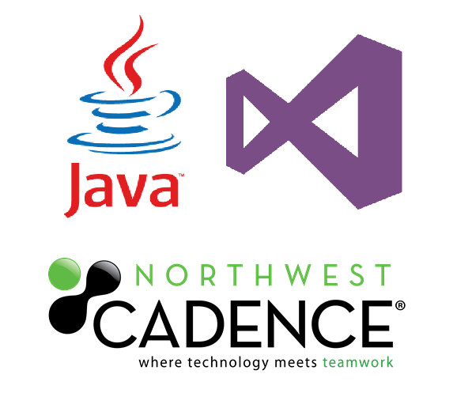

# Java Development with VSTS Hands on Labs

These hands on labs allow you to explore how VSTS works in a Linux environment with [Visual Studio Team Services (VSTS)](https://www.visualstudio.com/en-us/products/visual-studio-team-services-vs.aspx), [Eclipse](https://eclipse.org/downloads/) and [Team Explorer Everywhere](https://www.visualstudio.com/en-us/products/team-explorer-everywhere-vs.aspx). This combination of tools and technologies allows you to leverage the Microsoft DevOps platform for Java development. 

The [labs](labs/readme.md) use a pre-built virtual machine image that is preconfigured with all the software you require to run through the labs.  To use the labs, you will run a copy of this image in your own Azure subscription.

> We've recorded some short videos that intro each lab. Check out this [playlist on YouTube](https://youtu.be/O1UTj-wZr3k?list=PLu1D89Nlvq9hUaf-wdBXVcKfQiqY7Y0AI).

Instead of manually creating the resources in Azure, you are going to use Azure Resource Management (ARM) templates.

If you require assistance with these labs, contact Northwest Cadence through our [website](http://nwcadence.com).

**Tasks**

1. Provision the VM and dependent resources

## Task 1: Provision the VM and Dependent Resources

1. Create the VM and dependent resources.
    
    Simply click the Deploy to Azure button below and follow the wizard to create the resources. You will need to log in to the Azure Portal.
                                                                     
	
	

    The resources will be deployed to a Resource Group. You can delete the resource group in order to remove all the created resources at any time.

	The VM will take a few minutes (~20) to complete. The VM is installing required software and configuring the environment for the labs.

## Start the Labs
Once the VM has been provisioned, remote desktop to the machine and log in. You can then [start the labs](labs/readme.md).

1. Get the IP address/DNS name of the machine.

In the Azure portal, select the VM to view details about it in the Overview panel and copy the Public IP address (optionally, copy the DNS name instead).

1. Remote into the machine in Windows.

If accessing the VM from a Windows machine, paste in the IP address/DNS name into a Remote Desktop Connection window followed by a colon and the 3389 port. This will allow you to view the GUI of the Linux VM desktop.

In the RDP session, you will need to put your credentials set earlier to log into the machine. 
