## Setting up a local Build agent

In this exercise, you will configure a VSTS Cross Platform Build &
Release Agent on the local machine. You will download and configure the
agent. You can find more information at
<https://github.com/Microsoft/vsts-agent>.

The user account you use for running builds will need the correct
permissions. VSTS is flexible is managing these permissions for
production scenarios. For now, you’ll just do a quick configuration.

Setting up Agent Pool permissions on VSTS
-----------------------------------------

1.  In your VSTS Account, click the Admin cog in the upper right corner.

 

VSTS opens a new browser tab at your Team Project profile.

1.  Click on your VSTS account link and select the **Agent pools** tab.

    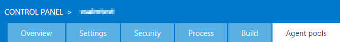

1.  In the **All pools** list, make sure you’ve selected
    **Default (Default)**.

    

2.  Then click **Roles** under **Roles for pool Default**.

    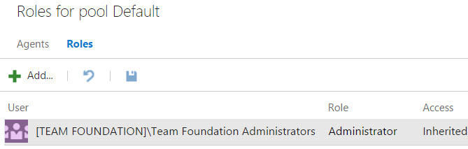

1.  Click the **Add** button. Type your name in and select the Role
    Administrator then click **Add** button.

    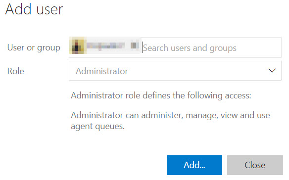

` Note: Skip Step 5. If you are owner of the VSTS account. If not
 owner request the account owner to perform above steps to add you Pool
 administrator role.`

1.  Click on download agent to download.

    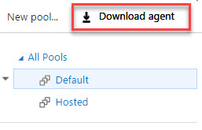

    8 In the Get Agent window select **Ubuntu 14.04-x64** under Linux
    operating system window, click on **Download** button to download
    the agent.

    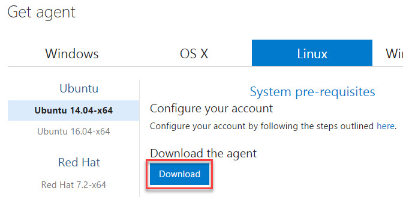

Creating Personal access tokens(PAT)
-----------------------------------------

 In order to configure build agent for VSTS account we need to create a Personal access token.

1.  In the upper right corner, click you name (1) which opens a drop
    down menu, and then click the Security (2) menu option.  

    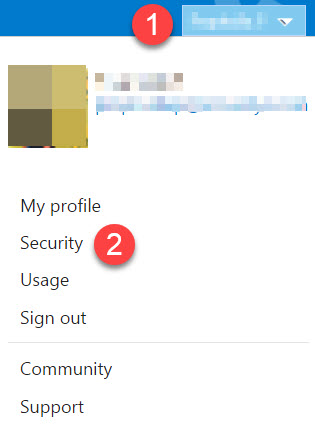

2.  On the new page, click the **Add** button under Personal access
    tokens tab.

3.  In the Create a personal access tokes page, provide the token description, select VSTS account and then click on **Create
    token** button at the bottom.

    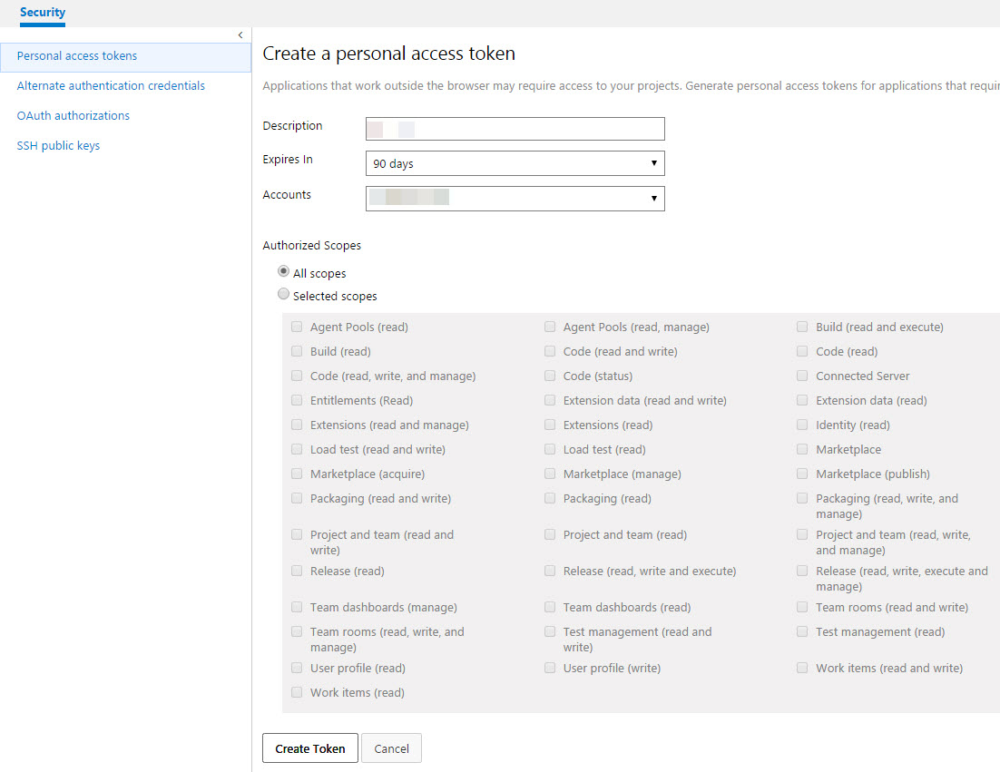

4.  When you are done make a copy of token, you will use this token
    as your password.

    

5.  You can close the “admin” tab in your browser.

Configuring the local agent on the VM instance
----------------------------------------------

1.  Now, open a Terminal window from the shortcut panel at the bottom

    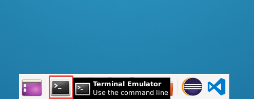

2.  Type the following command to install the pre-requisite libraries
    for Ubuntu.

sudo apt-get install -y libunwind8 libcurl3 libicu52

1.  Once the libraries are installed, type the following command to
    extract the downloaded archive file. Make sure that you are pointing
    to the right location where the achieve was downloaded

mkdir myagent && cd myagent

myagent$ tar zxvf ~/vsts-agent-ubuntu.14.04-x64-2.104.2.tar.gz

Once extracted you will see below folder or files in your myagent folder

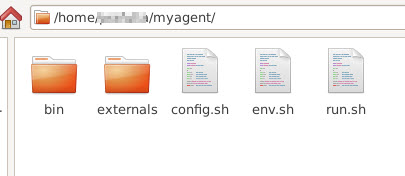

Switch back to the terminal, and execute below command to configure
agent (1).

**~/myagent$** ./config.sh

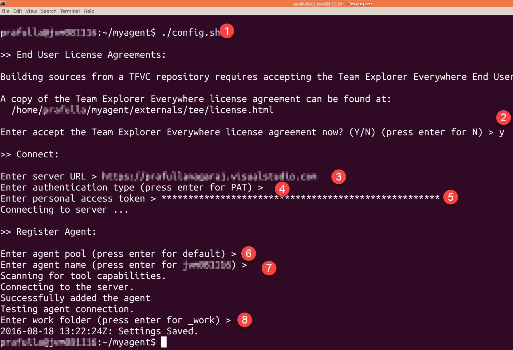

-   Type in **Y** and hit Enter when asked for accepting license
    agreement (2).

-   Next enter the server URL by providing your VSTS account URL then
    hit Enter (3), format is
    https://&lt;your-account&gt;.visualstudio.com

-   Use the default authentication type PAT just by hitting enter (4)

-   Provide the personal access token (5) which you have copied and
    saved as mentioned in **step 7.iv**

-   Accept default setting in coming steps (6), (7), (8) by
    hitting enter.

-   Once setting saved you should be able to see agent created under
    default agent pool, but it is offline as shown in below screen shot.

    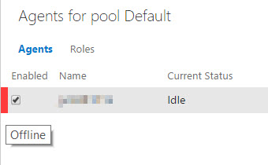

    To get agent online, switch back to terminal and run below command.

**~/myagent$** ./run.sh

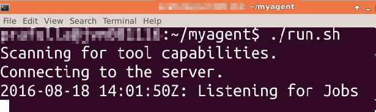

Now we can see that the agent is online under default agent pool.

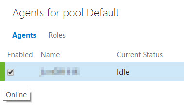

The agent will run until you stop it by pressing Ctrl +C and/or shutdown
the VM.

<pre><b>Note:</b> You will need to configure the agent only once. To run the agent, use <b>./run.sh</b> at the terminal window. 
To reconfigure the agent settings, use the <b>./configure.sh</b> script</pre>

<pre>You’ll need to restart the agent manually each time you restart the VM. In a production situation 
you could configure the agent to start automatically as a daemon. Service mode is supported only in Ubuntu 16. 
You’ll find notes on how to do this at the GitHub site for the
agent listed earlier.</pre>

You can now run the build definition using the agent you have setup instead of the **hosted** agent.
