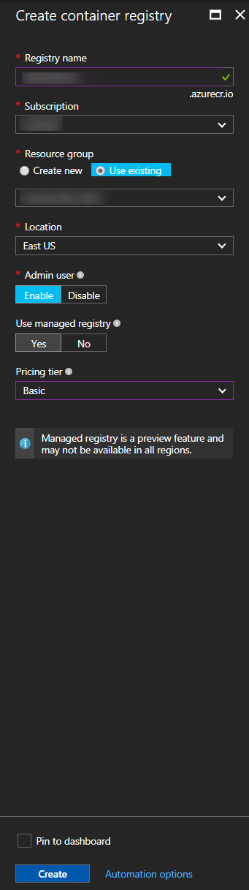

## Building Docker Containers with VSTS

In this exercise, you are going to create a Docker Registry in Azure as well as a VSTS build that will build two Docker cotainer images and publish then to the registry. In a later lab you will configure a Release in VSTS to run the containers.

This exercise assumes you have completed the exercises to create a Team Project and have set up the Docker private VSTS agent. You should also have set up Maven package management and have a MyShuttleCalc package in the feed. This exercise uses a team project named **jdev**, though your team project name may differ.

> **Note**: You don't have to use the Azure container registry - you can use whatever registry you choose. You can also create an equivalent build using Jenkins.

Create a Docker Container Registry in Azure
-------------------------------------------
1. Open a browser and navigate to the Azure Portal (https://portal.azure.com).
1. Click the + icon in the upper left of the menu, type "azure container registry" and press Enter.

    

1. Click on "Azure Container Registry" and then click the Create button from the Azure Container Registry item blade.

    

1. Enter a name, resource group, location and storage account. Click Create when you are done.

    

1. After a few moments, your registry will be created.

Update the pom.xml File for MyShuttle2
--------------------------------------

In this task you will update the pom.xml file for the MyShuttle2 application so that it can consume the MyShuttleCalc package from the Maven package feed.

1. In Chrome navigate to your VSTS account and team project. Click on the Build & Release Hub, click on Packages, and select the Maven feed. Click on "Connect to Feed". Click on the copy button in the section labeled `Add this feed to your project pom.xml inside the <repositories> tag`.

    

1. Open IntelliJ by clicking on the IntelliJ icon in the toolbar.

    

1. Open the MyShuttle2 project.
1. Click on the pom.xml file.
1. In the `<repositories>` element there is a reference to a Maven repo. Paste in the repository settings you got from VSTS.
1. Find the `<dependency>` with `<groupId>com.microsoft.exampledep</groupId>` and update the version number to match the version number of the MyShuttleCalc package in your package feed.

> **Note**: You may have to reload the Maven project to update the plugins and dependencies. You can do this by clicking `View->Tool Windows->Maven` and then clicking the reload button (the top-left icon in the Maven project view).

1. Click Build->Build Project and make sure there are no errors.
1. Click VCS->Commit. Add a commit message "Updating feed settings". Click the drop-down on the Commit button and select Commit and Push. Click Push on the prompt.

    

Create a VSTS Build to Build Docker Images
------------------------------------------

In this task you will create a VSTS build definition that will create two containers (a mysql database container as well as a tomcat container for running the MyShuttle2 site). The build will publish the containers to the Azure Container Registry you just created.

1. Connect to the virtual machine with the user credentials which you specified when creating the VM in Azure.
1. Open Chrome and browse to `http://<youraccount>.visualstudio.com` (where `youraccount` is the account you created in VSTS).
1. Click on the `jdev` project and navigate to the "Build & Release" Hub.
1. Click on Builds to go the Builds view. Click on "+ New" to create a new Build definition.

    

1. Type "maven" into the search box. Click on the Maven template and click Apply.
1. 