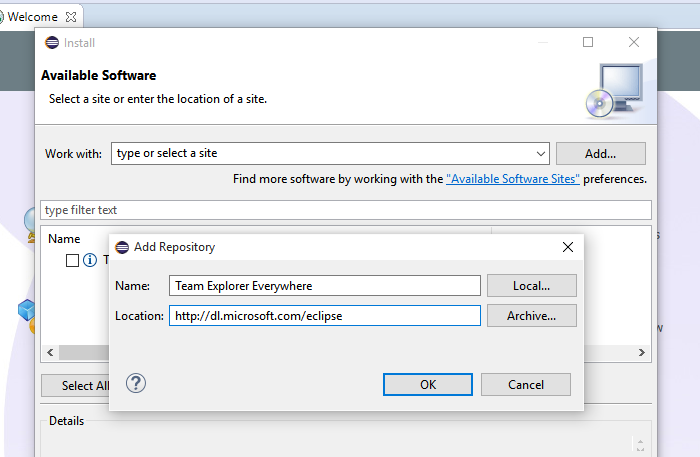
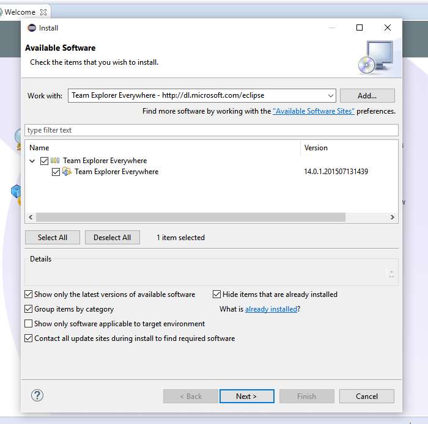
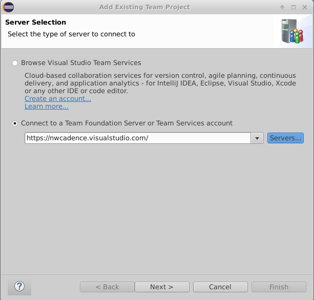
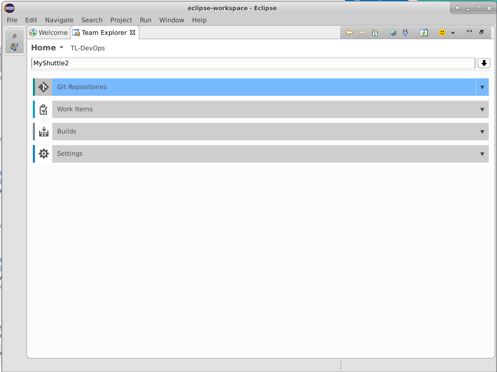
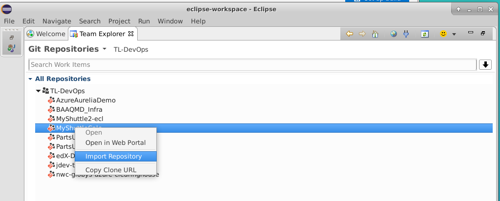

## Eclipse - Working with Git

In this exercise, you are going to clone a Github repo into VSTS and then open clone it to your VM for editing in Eclipse.
This exercise assumes you have completed Exercise 1, and have created a Team Project that uses Git for version control. This exercise uses a team project named **jdev**, though your team project name may differ.

> **Note**: It is not necessary to clone Github repos into VSTS. VSTS will work just fine with Github (or other Git hoster) repos. However, some linkages from source code to other aspects of the DevOps pipeline (such as work items, builds or releases) work best if the code is in VSTS.

**TODO HERE:**

Importing a Github Repo into VSTS
---------------------------------

In this task you will import code from a Github repo into VSTS.

1. Connect to the virtual machine with the user credentials which you specified when creating the VM in Azure.
1. Open Chrome and browse to `http://<youraccount>.visualstudio.com` (where `youraccount` is the account you created in VSTS).
1. Click on the `jdev` team project to navigate to it. Click on Code in the blue toolbar at the top to open the Code Hub.
1. Click on the repo drop-down in the upper left (in the grey toolbar) and select "Import repository"

    

1. Enter the following url: `https://github.com/nwcadence/MyShuttle2.git` and click Import.

    

1. After a few moments, the code will be imported.

Connect to VSTS from Eclipse
-----------------------------

1. Click on the Eclipse icon in the toolbar to open the whichEclipse Java IDE.

    

1. The first time you run Eclipse, it will prompt for default workspace. Click on the box "Use this as the default and do not ask again" to use the default workspace on startup.

    

1. When the Welcome dialog appears, on the Help Menu select Install New Software.

    

1. Choose the Add button to add a new repository.  Use Team Explorer Everywhere as the name. The location of the update site is http://dl.microsoft.com/eclipse

    

1. Choose the OK button.

1. In the list of features in the Install dialog box, select the check box that corresponds to the Team Explorer Everywhere. If you don't see this option, use the pull-down menu for Work with: and find the update site URL you just entered in the list and select it, then select the check box beside the plug-in mentioned above.

    

1.  Choose Next two times. Accept the license agrement and choose Finish

1.  Eclipse will need to restart.

1. When Eclipse restarts, the Welcome dialog will appear again. Choose Windows > Show View and select Other...

    

1. Search for Team Explorer, select the Team Explorer View, and select OK.

    

1. Click on "Connect to Team Services ..." to sign in to your VSTS account.

    

    

Add a Server and enter your credentials.  If you get the credentials wrong you can try again by closing Eclipse, deleting ~/.microsoft/Team Explorer/4.0/*, and restarting Eclipse.

1. Once you have authenticated, choose Git Repositories, find "MyShuttle2" and select the MyShuttle2 repo from your team project. Right click on any repository and select Import Repository

    

    

    

1. Press "Alt-1" to open the Project View.
1. Expand `src\main\java\com.microsoft.example` and click on "DataAccess" to open the DataAccess class.
1. A yellow warning appears in the main editor window prompting you to "Setup SDK". Click on the link.

    

1. In the Select Project SDK dialog, click "Configure..."

    

1. In the upper left, click the green "+" icon to add a new SDK.

    

1. Select `java-8-openjdk-amd64` from the folder list and click OK. Click OK back through the rest of the dialogs.

    

> **Note**: The project will not currently compile, since it has a dependency on a library (MyShuttleCalc) that it cannot resolve. You will fix this in the Package Management lab.