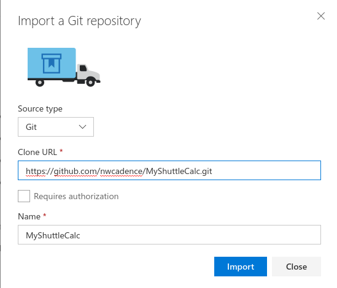
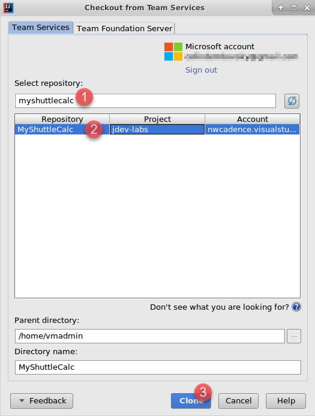
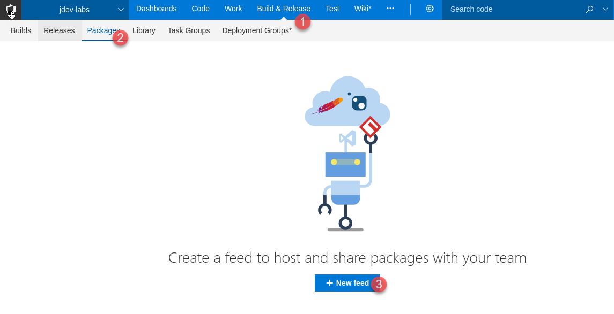
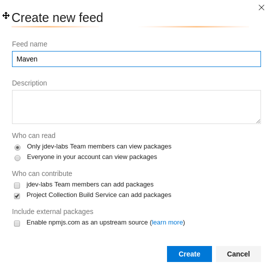
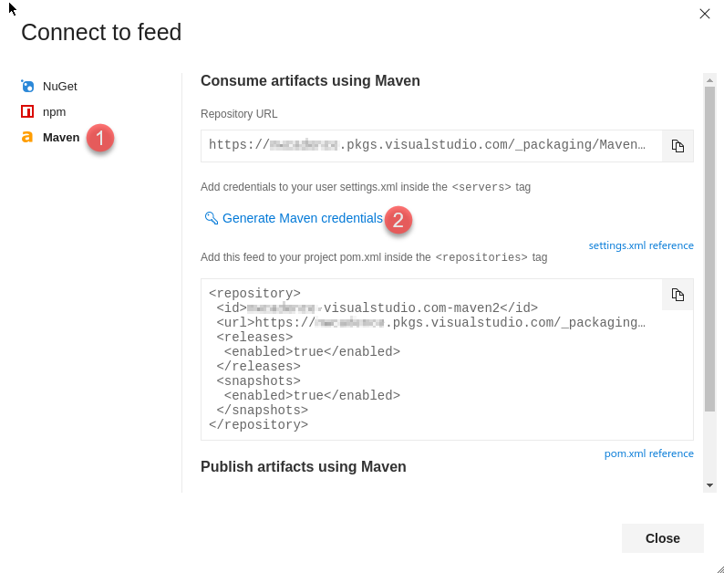
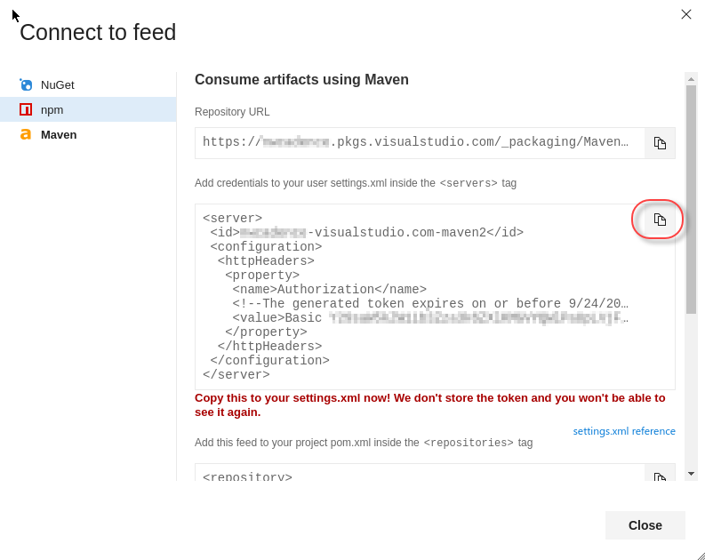
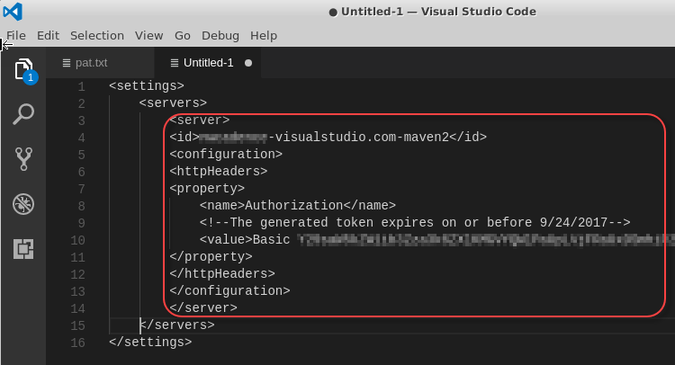

## Maven Package Management with Visual Studio Team Services

In this exercise, you are going to clone a Github repo into VSTS. This repo contains a class library that is used by the MyShuttle2 application. You will configure the build to publish the MyShuttleCalc package to a VSTS Maven repository so that it can be consumed by MyShuttle and any other applications that require the calculation code.

This exercise assumes you have completed the exercises to create a Team Project and have set up the Docker private VSTS agent. This exercise uses a team project named **jdev**, though your team project name may differ.

> **Note**: It is not necessary to clone Github repos into VSTS. VSTS
will work just fine with Github (or other Git hoster) repos. However,
some linkages from source code to other aspects of the DevOps pipeline
(such as work items, builds or releases) work best if the code is in
VSTS.

Importing the MyShuttleCalc code from Github into VSTS
------------------------------------------------------

In this task you will import the MyShuttleCalc code from Github into VSTS.

1. Connect to the virtual machine with the user credentials which you specified when creating the VM in Azure.
1. Open Chrome and browse to `http://<youraccount>.visualstudio.com` (where `youraccount` is the account you created in VSTS).
1. Click on the `jdev` team project to navigate to it. Click on Code in the blue toolbar at the top to open the Code Hub.
1. Click on the repo drop-down in the upper left (in the grey toolbar) and select "New repository".

    

1. Enter the following url: `https://github.com/nwcadence/MyShuttleCalc.git` and click Import.

    

1. After a few moments, the code will be imported.

Clone the MyShuttleCalc repo
----------------------------
In this task you will clone the MyShuttleCalc repo. This repo contains a Maven package settings file that you will need to authenticate to the Maven feed.

1. Click on the IntelliJ icon in the toolbar to open IntellJ IDEA.


1. Click "Check out from Version Control" and select "Team Services Git".


> **Note**: (If you have a project open, then you can also click File->New->Project from Version Control->Team Services Git)

1. Click on "Sign in..." to sign in to your VSTS account.


1. Once you have authenticated, enter "MyShuttleCalc" into the search bar and select the MyShuttleCalc repo from your team project. Click the Clone button to clone the repo to the VM.



1. IntelliJ detects a Maven project file (pom.xml) and asks if you want to open it. Click "Yes" to open the project.

Create a Maven Package Feed
---------------------------

In this task you will create a Maven package feed. You will publish packages to this feed as well as consume packages from this feed.

1. In VSTS, click on "Build & Release" and then Packages to go to the Package Hub. Click "+ New Feed" to create a new feed.



1. Enter "Maven" for the feed name and click "Create".



You now have a feed that you can publish package to.

Create a Maven Settings File with the Feed Credentials
------------------------------------------------------

In this task you will create credentials for the Maven feed. You will then create a settings.xml file containing the credentials.

1. In the Packages Hub, make sure you have selected the Maven feed and click "Connect to Feed".
1. In the left menu, click on Maven.

> **Note**: At the time of writing, Maven package feeds are a preview feature. You will need to enable the Maven package feed feature in order to connect to Package Management to/from Maven.

1. Click "Generate Maven Credentials"



1. VSTS creates a credentials snippet. Click the Copy to Clipboard button to copy the snippet to the clipboard.



1. In IntelliJ, open the `MyShuttleCalc\maven\settings.xml`.
1. Delete the comment `<!-- paste maven package feed credentials section here !-->` and replace it with the snippet between the `<servers>` and `</servers>` tags so that the final result looks like this:



1. Press Ctrl-S (or File->Save) and save the file.
1. Click VCS->Commit Changes to commit your changes to the repo.


1. Enter "Adding maven credentials" to the commit message.
1. Click the drop-down next to the Commit button and select "Commit and Push".

> **Note**: If this is your first commit to VSTS, you will be prompted to update your display name and email address for the repo. These are simply for display purposes, but usually are matched to your VSTS profile.

1. Place the settings.xml file containing your Maven feed credentials in the correct location for the VM as well as for the VSTS agent running in Docker by running the following commmands in a terminal:

```sh
cp ~/MyShuttleCalc/maven/settings.xml ~/.m2/
docker exec -it vstsagent /bin/bash
mkdir .m2
exit
docker cp ~/.m2/settings.xml vstsagent:/.m2/settings.xml
```

> **Note**: The previous commands copy the settings file to the `.m2` directory on the VM so that Maven can resolve packages in IntelliJ. You then run a `docker exec` to connect to the vstsagent container. Inside the container, you create a `.m2` folder and then exit the container. Finally, you copy the same settings file from the VM into the container. Now both the VM and the VSTS agent have access to the Package Management feed.
