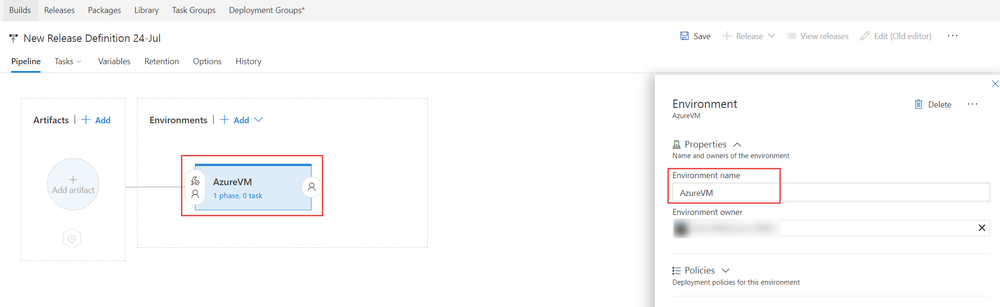

## Building Docker Containers with VSTS

In this exercise, you are going to create a Release Definition that will start the container images from the build lab. You will then create an Azure Container Service (ACS) and modify the Release to start containers in ACS.

This exercise assumes you have completed the exercises to create a Team Project and have set up the Docker private VSTS agent. You should also have set up Maven package management and have a MyShuttleCalc package in the feed and created a build that creates and publishes Docker images to the Azure Container Registry. This exercise uses a team project named **jdev**, though your team project name may differ.

Create a Release Definition
---------------------------

In this task you will create a Release Definition with a single environment called Dev. You will configure the release to stop running containers (if any) to free the host ports and then run the latest container images in Docker on your Azure VM.

1. Connect to the virtual machine with the user credentials which you specified when creating the VM in Azure.
1. Open Chrome and browse to `http://<youraccount>.visualstudio.com` (where `youraccount` is the account you created in VSTS).
1. Click on the `jdev` team project to navigate to it.
1. Navigate to the latest successful MyShuttle2 build summary page. Click on "Build & Release" in the blue toolbar at the top to open the Build & Release Hub and then click on Builds in the grey toolbar. Click the build number next to the MyShuttle build.

    

1. Click "Create Release" in the Deployment section below the Code Coverage results.
1. A new Release Definition is created. In the flyout, click on "Empty process" at the top of the templates selection page to start with an empty template.
1. Click on Environment1 to open the properties flyout. Change the name to "AzureVM".

    

1. Click the link labelled "1 phase(s), 0 task(s)" in the AzureVM environment card to open the phases/tasks editor for the environment.
1. Click on the "Agent Phase" row and change the Queue to "default" so that your private agent executes the release tasks for this phase of the release.

    

1. Click the "+" icon on the phase to add a new task. Type "docker" in the search box. Add a "Docker Compose" task.
1. Set the following properties for the Docker Compose task:
    Parameter | Value | Notes
    --- | --- | ---
    Container Registry Type | Azure Container Registry | The release will get images from an Azure Container Registry
    Azure subscription | `<your sub>` | The subscription with your Azure Container Registry
    Azure Container Registry | `<your acr>` | The container registry you created in a previous lab
    Action | Run service images | Sets the action to perform (in this case an `up` command)
    Build Images | Unchecked | Use the images that were built in the build process

1. Click the Save button in the toolbar to save the definition.
1. Click the "+ Release" button and then click Create Release.

    

1. Click the queue button on the Create a new release dialog to start the release.

    

1. Click on Logs to view the logs from the release.

    

